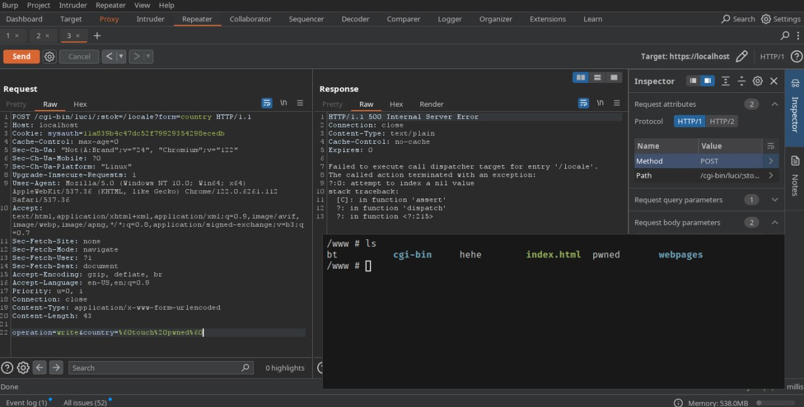

# description

Reproduce CVE-2023-1389.

# emulate and exploit 

First, use `binwalk` to extract the firmware and then use the command `file /bin/busybox` to determine the architecture.

Afterward, emulate it with QEMU. The pre-built kernel and image are downloaded from [here](https://people.debian.org/~aurel32/qemu/). You may need to run it with `sudo` or using `setcap` because of binding to low-number ports 80 and 443.

```bash
sudo setcap CAP_NET_BIND_SERVICE=+eip /usr/bin/qemu-system-arm
```

```bash
qemu-system-arm \
	-M vexpress-a9 \
	-kernel ./vmlinuz-3.2.0-4-vexpress \
	-initrd ./initrd.img-3.2.0-4-vexpress \
	-drive if=sd,file=./debian_wheezy_armhf_standard.qcow2 \
	-append "root=/dev/mmcblk0p2 console=ttyAMA0" \
	-nographic \
	-net user,hostfwd=tcp::2222-:22,hostfwd=tcp::80-:80,hostfwd=tcp::443-:443 \
	-net nic
```

When the VM is up, use `scp` to copy the firmware's rootfs into the VM, and then `chroot` into it.

```bash
mount --bind /dev/ ./squashfs-root/dev/
mount --bind /sys/ ./squashfs-root/sys/
mount --bind /proc/ ./squashfs-root/proc/
chroot ./squashfs-root/ /bin/sh
```

Take a quick look at `/etc/inittab`. When the router is up, `rcS` is invoked with `S` and `boot` parameters to initialize services.

```
::sysinit:/etc/init.d/rcS S boot
::shutdown:/etc/init.d/rcS K shutdown
ttyMSM0::askfirst:/bin/login
```

You just need to run `/etc/init.d/rcS S boot` to start the router's services. When the web interface is up, do a quick setting and fire up BurpSuite.




# status

- [x] LAN exploit
- [ ] WAN exploit
- [ ] Reverse to find root cause (Lua Bytecode is dark)

# refs
- [MindShaRE: How to “Just Emulate It With QEMU”](https://www.zerodayinitiative.com/blog/2020/5/27/mindshare-how-to-just-emulate-it-with-qemu)
- [TP-Link WAN-side Vulnerability CVE-2023-1389 Added to the Mirai Botnet Arsenal](https://www.zerodayinitiative.com/blog/2023/4/21/tp-link-wan-side-vulnerability-cve-2023-1389-added-to-the-mirai-botnet-arsenal)
- [一次失败的路由器固件分析——CVE-2023-1389分析及复现](https://blog.hackall.cn/pentest/398.html)
- [反向编译OpenWrt的Lua字节码 （Decompile Lua bytecode of OpenWRT）](https://blog.ihipop.com/2018/05/5110.html/comment-page-1)
- [luadec-tplink](https://github.com/superkhung/luadec-tplink)
