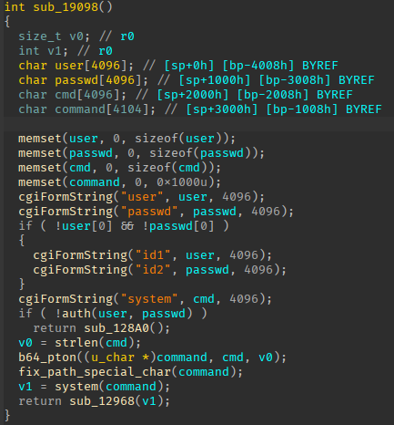

# description

Reproduce CVE-2024-3272.

# exploit


Command injection occurs at the `system` parameter encoded in base64 at the `/cgi-bin/nas_sharing.cgi` endpoint. Below is an example of injecting `poweroff`.


The root cause is at `sub_19098` in `nas_sharing.cgi`. 



After being authenticated with a valid account, the value of the `system` parameter, represented as the `cmd` variable, is base64 decoded to the `command` variable by the `b64_pton` function.

The `fix_path_special_char` function is then applied, and the resulting `command` is passed to the dangerous `system` function.

The valid accounts can be retrived from `/etc/shadow`; however, it seems that only `admin` and `messagebus` are working:

```text
admin:$1$$qRPK7m23GJusamGpoGLby/:16405:0:99999:7:::             # empty
nobody:pACwI1fCXYNw6:0:0:99999:7:::                             # empty
squeezecenter:$1$$o7vIitnZu4MHlaR5S90M/1:15460:0:99999:7:::     # v4523086
root:$1$$qRPK7m23GJusamGpoGLby/:14746:0:99999:7:::              # empty
messagebus:$1$$qRPK7m23GJusamGpoGLby/:10925:0:99999:7:::        # empty
```

# emulate

FAT: ❌

QEMU: ✅

## usage

1. Run QEMU: `./gopro.sh`
2. chroot into firmware rootfs: `./chroot.sh rootfs`
3. Run webserver: `./start_lighttpd`

## note

When emulating using FAT, a kernel panic occurs, but when using QEMU with the kernel and rootfs built from Buildroot, it runs smoothly. Perhaps FAT is using musl, while this firmware is using glibc.

When building Kernel versions 3.x to 4.x, use a lower version of GCC, preferably version 4.x to 5.x, to avoid encountering missing compiler header errors.

Inside the firmware:

- `aa`: Ext2 root file system.
- `4B24B8.squashfs`: Contains modules that will be mounted to `/usr/local/modules`.
- `42E7`: tar archive, holds configs which will be mounted to `/usr/local/config`.

At the very first startup, we need to run `/etc/rc.sh`. It will start somes services but somes will result in a segment fault. However, it is neccessary to run it to create links, copy files to the correct place and create RSA key for `lighttpd.

`lighttpd` is invoked with:

```
/usr/sbin/lighttpd -m /usr/local/modules/web/modules/ -f /etc/lighttpd/lighttpd.conf
```

# references

* [Command Injection and Backdoor Account in D-Link NAS Devices](https://github.com/netsecfish/dlink)
* [D-Link DNR-322L - CVE-2022-40799 (Auth. RCE)](https://blog.mkiesel.ch/posts/dlink_dnr322/)
